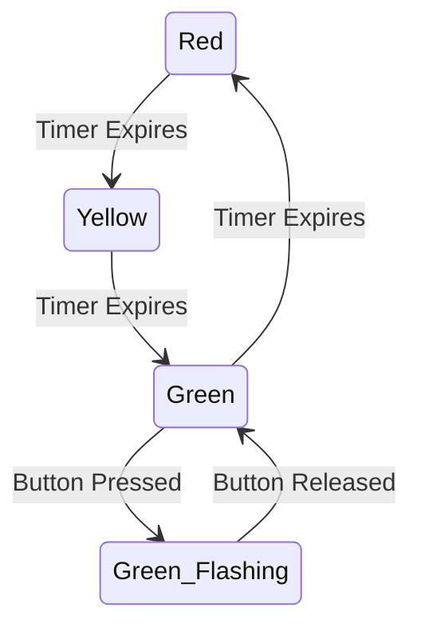
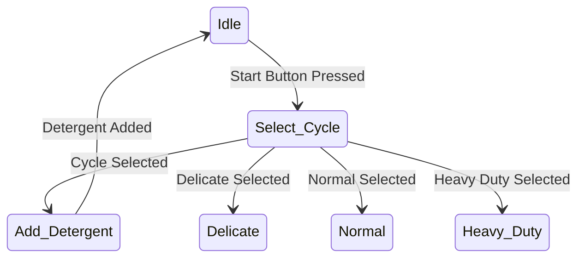
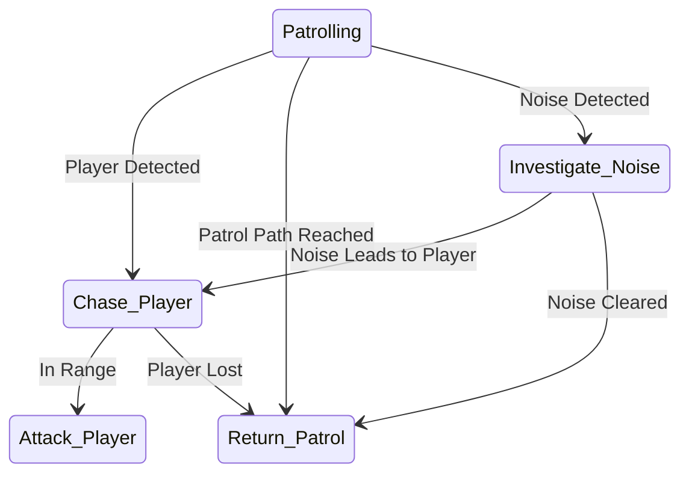
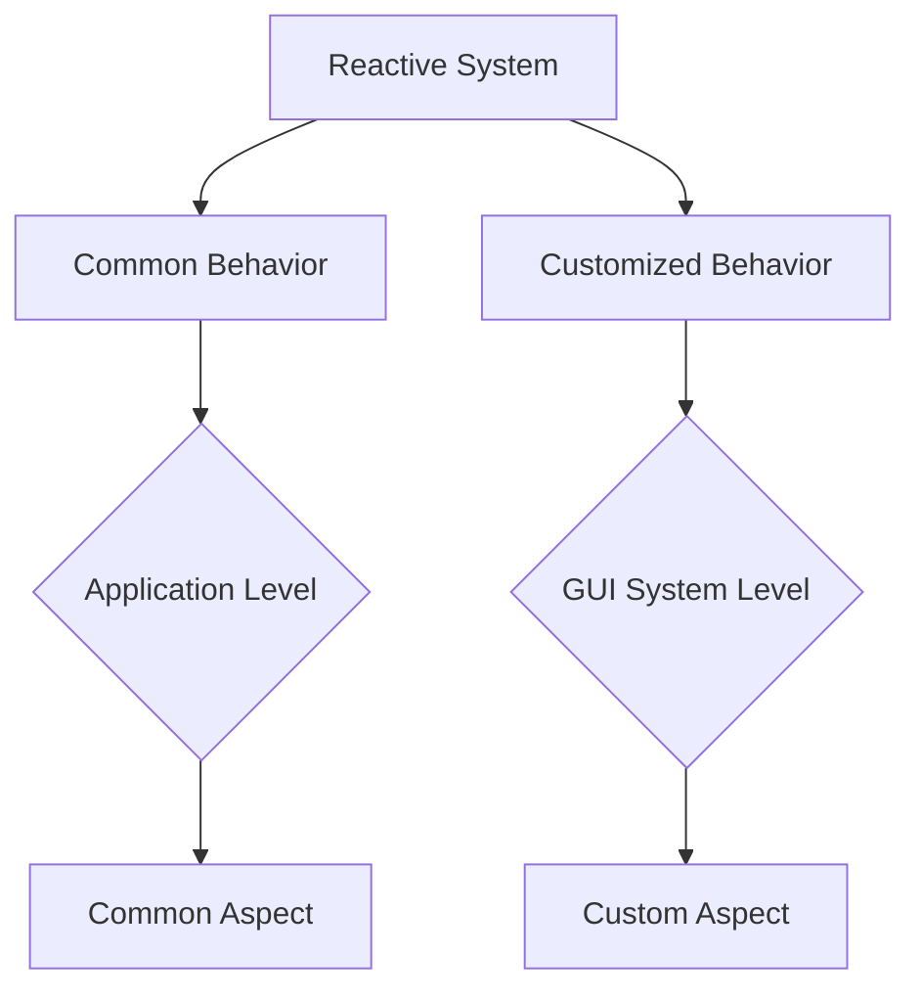
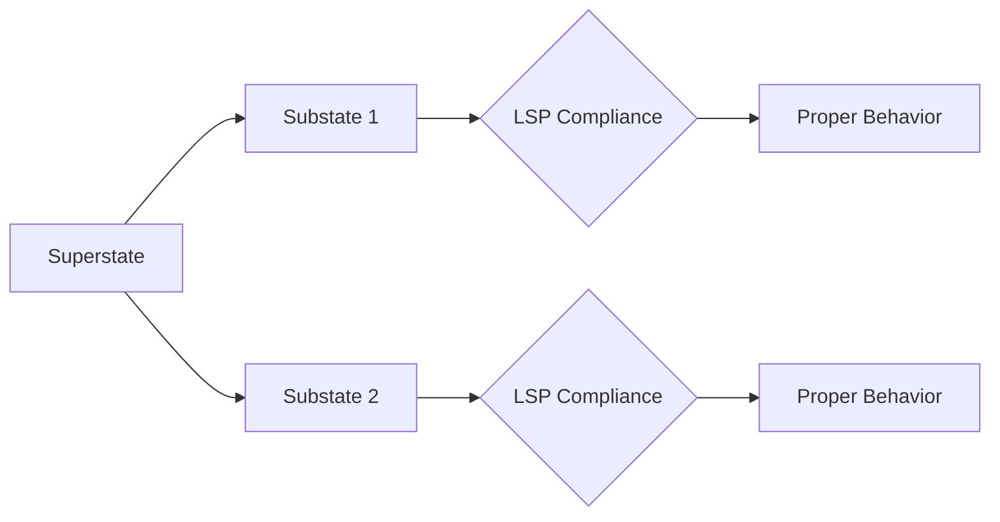
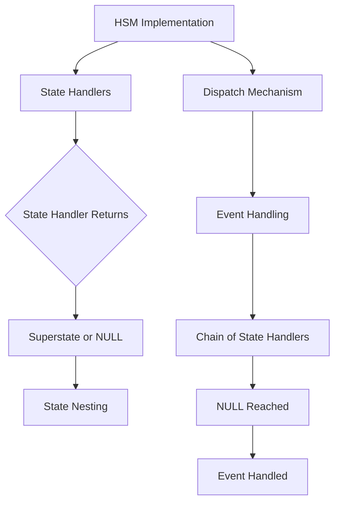
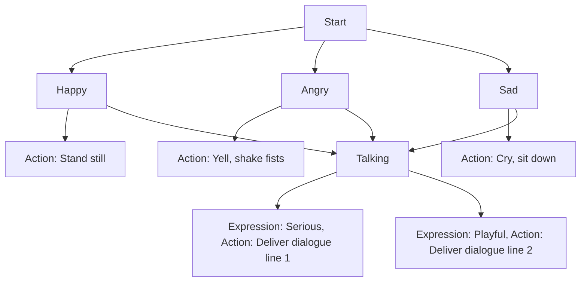

# Hierarchical State Machines

# Dictionary

- **State Machine:** Represents the behavior of a system by defining a set of states, transitions, and actions.
- **State:** Condition/Mode in which a system can exist, representing a specific behavior or set of actions.
- **Hierarchy:** Arrangement of states into levels or layers, where a higher-level state can contain substates, creating a structured organization of behavior.
- **Top-Level State:** The highest-level state in the hierarchy, which defines the primary context or mode of operation for the state machine.
- **Substate:** States that exist within a hierarchy, grouped under a higher-level state, allowing for modular representation of behavior.
- **Transition:** A change in state triggered by an event, condition, or action. Transitions define how a system moves from one state to another.
- **Event:** A stimulus or trigger that initiates a transition from one state to another.
- **Action:** A specific operation or behavior associated with a state transition, such as executing code, changing variables, or sending signals.
- **History State:** A state that represents the last active substate within a composite state, allowing the system to resume from where it left off.
- **Parallel States:** Multiple substates running concurrently within a higher-level state, representing parallel behavior within the system.
- **Orthogonal Regions:** A way to divide a state into multiple independent sub-regions, each with its own set of substates, allowing for parallel execution and complex behavior modeling.
- **State Hierarchy:** The organization of states into a tree-like structure with the top-level state at the root and substates branching out from it.
- **State Inheritance:** The ability for substates to inherit the behaviors, transitions, and actions of their parent state.
- **Modularity:** The use of HSMs to create modular and maintainable code by encapsulating related behavior within states and substates.
- **State Machine Framework:** Software tools or libraries that provide a structured way to implement HSMs and manage state transitions and behavior.

---

Top-Level is your starting point, this is what serves as the primary context for the state machine. When an event, action, or condition occurs, it transitions in a different state.

Stop Light:

Red (T-L/Main State) → Green (Timer Expires) → Yellow (Timer Expires) → Red

---

## Rundown

- Hierarchical State Machines (HSMs) organize states into a hierarchical structure.
- They model and control the behavior of complex systems.
- HSMs are used in computer science and software engineering.
- They are useful for systems with multiple levels of abstraction and decomposable states.
- HSMs provide a structured way to manage state transitions in large systems.

## Definition

- HSMs represent system behavior as a set of hierarchical states.
- Each state can have sub-states, creating a tree-like structure.
- Transitions and events at one level can affect states and sub-states at deeper levels.
- This simplifies the management of complex system behaviors.

## Examples

1. Traffic Light Control:
    - Main states: Red, Yellow, Green.
    - Sub-states within Green: Normal Operation, Flashing Green.
    - Transitions occur between main states, but sub-states activate under specific conditions.



1. Washing Machine Control:
    - Top-level state: Idle.
    - Sub-states within Idle: Select Cycle, Add Detergent.
    - Each sub-state can have its own set of sub-states, e.g., Delicate, Normal, Heavy Duty.



1. Game Character AI:
    - Top-level state: Patrolling.
    - Sub-states within Patrolling: Chase Player, Return to Patrol Path, Investigate Noise.
    - Each sub-state can have its own sub-states, e.g., Attack Player within Chase Player.



HSMs break down complex system behaviors into manageable levels of abstraction. 

- Easier to understand, Design, and Maintain software or systems. Transitions and events can affect different levels of the hierarchy, providing flexibility in controlling system behavior.

```scala
object TrafficLightControl {
  sealed trait State
  case object Off extends State
  case object Red extends State
  case object Yellow extends State
  case object Green extends State
  case object RedFlashing extends State

  // Function to handle state transitions
  def handleEvent(currentState: State, event: String): State = (currentState, event) match {
    case (Off, "on") => Red
    case (Red, "timeout") => Yellow
    case (Red, "buttonPressed") => RedFlashing
    case (RedFlashing, "buttonReleased") => Red
    case (Yellow, "timeout") => Green
    case (Green, "timeout") => Red
    case _ => currentState // Invalid event, stay in the current state
  }

  // Function to simulate state actions
  def performAction(state: State): Unit = state match {
    case Red => println("Red Light: Stop")
    case Yellow => println("Yellow Light: Prepare to stop")
    case Green => println("Green Light: Go")
    case RedFlashing => println("Red Light Flashing: Stop, proceed when safe")
    case _ => () // Other states do not have specific actions
  }

  def main(args: Array[String]): Unit = {
    var currentState: State = Off

    // Example usage:
    currentState = handleEvent(currentState, "on")
    performAction(currentState)
    currentState = handleEvent(currentState, "timeout")
    performAction(currentState)
    currentState = handleEvent(currentState, "buttonPressed")
    performAction(currentState)
    currentState = handleEvent(currentState, "buttonReleased")
    performAction(currentState)
  }
}
```

---

- **Introduction**
    - Discusses the benefits of using state machines in event-driven systems.
    - Highlights issues with traditional Finite State Machines (FSMs).
- **Challenges with Traditional FSMs**
    - Addresses the "state explosion" problem in traditional FSMs.
    - Explains how repetitive handling of events in multiple states can lead to complexity.
- **Statecharts**
    - Introduces statecharts, a formalism addressing FSM shortcomings.
    - Describes how statecharts efficiently share behavior, reducing complexity.

- **Reuse of Behavior in Reactive Systems**
    - Discusses the commonality of reusing behavior in reactive systems.
    - Introduces the "Ultimate Hook" pattern in GUI systems.
    - Explains how Harel statecharts combine the pattern with state machines.



- **Hierarchical States**
    - Discusses the introduction of hierarchically nested states in statecharts.
    - Explains the semantics of state nesting for behavior sharing.
- **Behavioral Inheritance**
    - Describes behavioral inheritance in hierarchical state machines.
    - Compares it to class inheritance in Object-Oriented Programming (OOP).
    - Discusses how substates can add, override, or modify behavior.

- **Liskov Substitution Principle (LSP) for States**
    - Extends the Liskov Substitution Principle to hierarchical states.
    - Discusses the requirement for substates to behave consistently with superstates.



- **Guaranteed Initialization and Cleanup**
    - Explains the importance of entry and exit actions in states.
    - Shows how they ensure safe initialization and cleanup.
    - Provides an example of turning on the DON'T WALK signal as an application.
- **A Closer Look at the Pelican HSM**
    - Examines a complete UML state diagram of the PELICAN crossing.
    - Explains how the state model guarantees minimal green light time for vehicles.

- **HSMs in C and C++**
    - Discusses the implementation of statecharts in C and C++.
    - Highlights the straightforward extension of the FSM technique.



- **Conclusion**
    - Draws parallels between fundamental concepts in OOP and HSMs.
    - Emphasizes the power of behavioral inheritance.
    
    ---
    
    ## Hiearchial State Machine (HSMs) vs Finite State Machines (FSMs)
    
    The main advantage of HSMs over FSMs is that they reduce complexity as the number of states increases.
    

---

